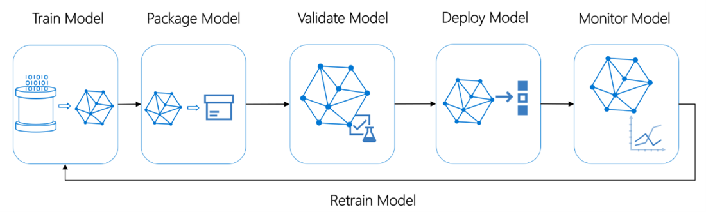

## MAIVA - Framework Table of Contents

[Introduction](#introduction)

- [How to use this playbook](#how-to-use-this-playbook)
- [Why GitHub](#why-github)

[Context for MAIVA](#context-for-maiva)

- [What good looks like](#what-good-looks-like)
- [Why is it so hard to achieve? (Lessons learned)](#why-is-it-so-hard-to-achieve-lessons-learned)

[Enabling the change](#enabling-the-change)

- [Executive role in culture](#executive-role-in-culture)
- [Systems thinking underpinning culture](#systems-thinking-underpinning-culture)
- [Being a data-driven culture](#being-a-data-driven-culture)
- [Approach to change management](#approach-to-change-management)

[Framework to Industrialize AI](#framework-to-industrialize-ai)

- [MAIVA – AI strategy and platform planning](#maiva-ai-strategy-and-platform-planning)
- [MAIVA – Innovation, Intake, Experimentation](#maiva-innovation-intake-experimentation)
- [MAIVA – the AI platform, the data platform, and the data (perpetual data strategy)](#maiva-the-ai-platform-the-data-platform-and-the-data-perpetual-data-strategy)
- [MAIVA – Develop, Deploy & Operationalize AI/ML Use Case](#maiva-develop-deploy-operationalize-aiml-use-case)

[MAIVA Operating model process and roadmap](#maiva-operating-model-process-and-roadmap)

[Security & Responsible AI considerations in AI governance](#security-responsible-ai-considerations-in-ai-governance)

[Economics of governance framework (or the opportunity cost)](#economics-of-governance-framework-or-the-opportunity-cost)

[Roles Supporting MAIVA](#roles-supporting-maiva)

- [The ongoing framework](#the-ongoing-framework)
- [The inaugural build](#the-inaugural-build)

[Resources](#resources)

[Gratitude for contributors](#gratitude-for-contributors)

# Introduction

## How to use this playbook

As AI technologies rapidly evolve, companies increasingly struggle to
realize the expected returns from investment in AI. It is not unusual
to expect 10x return on AI that improves the current processes or over
50x return on AI that drives new business models. But none of that
return can be realized if the investment in AI is ‘stuck’ in
pre-production Proof of Concept (PoC) or Minimum Viable Product (MVP) state. 
This playbook is designed to suggest some best practices for successful AI initiatives at scale.

 This playbook will provide:

- Context for industrializing AI within the enterprise

- A framework that covers key structures to industrialize AI

- The technical architecture(s) that serve the framework

- Economic considerations of the framework and various technologies

- Guidelines for resourcing the initial creation of the framework as
  well as resourcing for the on-going process

- Recommendations for managing change: change in the operating
  processes, change in skills, change in decision governance

- Resources that may provide additional help

Use this playbook as a guide to define your company’s unique path to
industrializing AI. Please clone this playbook in your own GitHub
environment to make it your own. And, as you learn and grow, consider
sharing back to the playbook.

## Why GitHub

This is also a question of ‘why open source’. We have been on this
journey of rapidly evolving AI for a few years. We have seen many
patterns that are common, regardless of technology, though some of
these patterns are accelerating. Our purpose is to enable people and
organizations to achieve more. Sharing openly, as in the tradition of
OpenAI itself, is essential to enabling every organization to realize
optimal value from their investment in AI.

GitHub is widely used and richly powerful. It is a tool for
technologists but is also readily used by laity. Because
industrializing AI is a framework that requires direct participation
from both the technologists and the business, GitHub is a great tool
to enable this team.

And GitHub helps build community. We hope that with each clone, there
is opportunity for feedback and improvement of the playbook itself.

# Context for MAIVA

Artificial intelligence (AI) is transforming every industry and creating
new opportunities for innovation and growth. To realize the full
potential of AI, organizations need to adopt a systematic and scalable
approach to *industrialize AI*. This playbook illustrates a
comprehensive framework to manage AI investments through a cycle of:

- An important starting point is a well-defined **intake and triage
  process** to assess and prioritize AI investments or use cases. This
  process should include a broad set of stakeholders from across the
  business, functional areas and technology areas. The balance to strike
  is to be structured enough to avoid investing in ideas whose time has
  either passed or it is too soon to work while being open enough to get
  the diamond in the rough, the magic hiding among the muck.

- **Experimentation and learning** are essential to prioritizing the
  right AI investment ideas. This is where a PoC might have some
  important contributions.

- An **agile, product management** approach to development brings
  discipline and focus to each AI initiative.

- Remember that value lives in production. If the AI initiative does not
  conclude with **deployment to a production environment**, the intended
  return cannot be realized. This is not to say that PoC’s have no
  value; rather it is to say that PoCs are not the vehicle to ROI.

- **Scale value** can take considerable time; set expectations properly.
  Sometimes deployment into production is just a first step to global
  impact.

- **Monitoring AI, measuring performance** and building systematic
  **feedback loops** between users and developers will drive the
  expected return and keep investments on the intended track.

- **Securing AI** is fundamental to ensure that Return on Investment (ROI) expectations are not
  adversely impacted by unsecure AI applications that can either be
  misused or that provide compromised responses.

We will also provide a point of view about the operational implications
of an AI governance framework as well as the role that privacy and
responsible AI policies play. Suggested architectures will be provided
and we will dig into the economics of industrializing AI. We will close
the playbook with recommendations on resourcing the roadmap to enable
the governance framework and to manage it thereafter.

## What good looks like

Value from AI is realized after a solution is deployed to production and
used at scale. Innovating is important; scaling the outcome of
innovation is the challenge of the day. Managing a portfolio of
initiatives through deployment and scale will be essential to drive
return and mitigate risk and underperformance.

Companies need a framework through which the portfolio of AI initiatives
can be prioritized, developed with consistency, and governed
post-deployment. We think about this framework as *industrializing AI*:
creating a systemic approach to ideation, intake, experimentation,
prioritization, development and deployment, and governance and
performance monitoring.

Through this framework each AI initiative will have a common journey
within a structured operating model of strategy/planning, data &
platforming, AI use case development, performance measurement and
monitoring to provide feedback loops to developers.

## Why is it so hard to achieve? (Lessons learned)

There are many obstacles blocking scale value from AI investments:

- Getting stuck in PoC’s that do not get beyond demos. The lesson here
  is to commit to driving a return from the investment in AI. 
  
- Indeed, all too often, AI initiatives are built without defining measurable
  results for success and without feedback loops from users to
  developers. If performance is not defined and monitored, how can
  anyone know what success looks like? The lesson here is to define,
  implement and measure KPIs at every stage and every activity of the
  process and bring those insights for retrospective through the
  feedback loop. Having AI investments pop up in every corner of the
  organization is diffused chaos and makes it challenging to funnel
  investment in a controlled way. The lesson here is to enable
  governance and determine where centralization makes sense.

- Overlooking the underlying business process can mean that deployed AI
  is not delivering optimal results. The lesson here is to bring a
  disciplined approach to change management.

- Having AI investments entirely controlled within the confines of IT
  means that the business that will be impacted is not involved in
  ideating, prioritization or in the design of the user experience. The
  lesson here is to fully partner with the business and contionuously involve 
  the business to drive adoption throughout the entire process,
  from inception to production.

- ‘Shadow’ IT groups within the business cannot deliver optimal
  technical results to the business without access to the enterprise
  infrastructure and platforms. The lesson here is to partner with IT to
  ensure optimal outcomes and long-term maintenance of AI products.

- Loss of IP, loss of data and harmful outcomes from AI initiatives are
  all significant risks for which mitigation can drive up costs and risk
  of reputational damage is potentially existential. And because
  security, privacy and responsible AI are domains with scope beyond any
  given line of business or functional area, these policies should be
  enterprise-wide. The lesson here is that these policies are essential
  to the AI governance framework but are not created within the
  framework.

- Skilling continues to be a perennial challenge; data science and data
  experts can be scarce resources. The lesson here is that upskilling
  resources in both the lines of business and IT will help to mitigate
  and optimize results over the long term.

To address some of these lessons learned, the Finance organization in
Microsoft adopted this approach to ground their investments in AI and
drive optimal change:

# Enabling the change

A recent study from IDC shares the attributes of enterprises considered
to be leaders in AI; the inference is that taking the lead with AI is as
much an art as it is science. The art of successful AI investment comes
through executive leadership, a data-driven culture and effective change
management. To build successful models, one must be willing to
experiment and iterate. One must be willing to fail and learn from
failure; this is the cultural attribute that defines companies that lead
with AI. The willingness to fail and to learn from failure… and the
leadership that enables experimentation and learning from failure. At
Microsoft we call this having a growth mindset. And we have built our
culture around it.

Change management is the key to enabling the digital culture and will be
heavily dependent upon the role of executive leadership, systems
thinking and being data driven.

## Executive role in culture

The executive role in shaping the culture cannot be overstated and
should extend to a clear commitment to culture from the entire
leadership. If there is any hesitation or ambivalence, this will
permeate the organization and diminish agility. The key attributes of
culture of companies that lead with AI are agility, experimentation,
focus on learning. The executive community of the organization must be
seen to value and exemplify these attributes. The role of the executive
community in shaping culture cannot begin and end with a communications
plan; it must include explicit display of their own curiosity and
willingness to try again and again in order to learn. And the executive
community must elevate and applaud those examples of failure that lead
to valuable insight.

## Systems thinking underpinning culture

As you will see through this document, we strongly encourage defining
the business problem to be solved before defining the technical
capability. AI investments must take a more wholistic approach to
deliver successful results. Systems thinking is an approach to problem
solving that considers complex systems as a whole and as such can be an
important enabler of AI initiatives. Systems thinking will ask us to
understand the interdependencies and relationships between different
parts of a system and how changes in one might impact the whole. We
consider the business ecosystem (culture, organization, policy, process)
and the technical infrastructure of the enterprise to both be parts of
the system. Systems thinking helps teams anticipate and mitigate
potential risks and unintended consequences of changes in culture,
process *and* technology.

The goal of systems thinking is to enable enterprise teams to establish
a systemic approach to improving business capabilities by deploying and
operating AI solutions in production and realize value through scale.

## Adopting a data-driven culture 

Being data-driven is the foundation for leading in the era of AI. Agile
experimentation leads to successful outcomes because it uses data to
define the hypothesis and data to measure the outcome. The company that
is data-driven uses data as the starting point of strategy, operations,
and market growth. This puts a great deal of importance on the quality,
completeness and fidelity of data. This requires a strong and
well-focused data strategy that is perpetual and perennial; it must be
considered in every AI initiative and updated with every shift in the
system.

## Approach to change management

#  Framework to Industrialize AI

The following diagram illustrates an enterprise framework to
industrialize AI and accelerate value. The process involves intake,
experimentation, evaluation, and prioritization of the newly raised AI
initiative. Once prioritized, the AI platform will require some set up
or enhancements before development and deployment of each AI use case.
And then the performance of the deployed AI is monitored and outcomes
are measured both to provide assurance of intended performance and to
provide visibility to future drift. The cycle is closed with feedback
loops from the users to developers driving continuous value.

Let’s dig into each area of MAIVA.

## MAIVA – AI strategy and platform planning

The AI strategy will be defined by the business strategy and expected
outcomes from investment in AI. The AI strategy should be reviewed
yearly during annual business planning though the size of investments,
often spanning multiple years, would benefit from stability in the AI
strategy across planning cycles. It is also a good idea to organize a
mid-year, state-of-the-AI strategy review, and surface insights about
the positives and challenges faced in that first half of the year.

Part of the AI strategy will include executive sponsorship of the
portfolio framework to ensure the appropriate involvement across the
enterprise, to ensure that investments are optimal, and to ensure that
the expected returns are realized.

Successfully industrializing AI will require an operating model that
involves organizational structure, product scope and process structure,
as well as an underlayment of security and responsible AI. The goal is
to enable AI initiatives through a consistent and controlled
cross-functional process, ensuring alignment between business objectives
and technical execution while mitigating risk and executing responsibly.

The operating model of industrialized AI is built on common policies for
security and responsible AI, data strategy, and data privacy and access
policies. Platforming of data and AI will, likewise, serve as a
foundational enabler for the operating model; but, platforms will shift
and expand as use cases extend into multiple business areas.

The operating model underlying MAIVA will be the blueprint for
successful execution and optimized return from AI investments. The key
components in that blueprint include the people, process and
technologies involved:

- The people serving on the governing board will come from
  cross-functional areas of the business and cross-domain technical
  teams. Participants will include representatives from business teams,
  finance, marketing, and product teams to articulate the business
  outcomes from AI. The data, infrastructure and AI technology teams
  should also be represented. And, security and responsible AI should
  have seats at the board.

- The process will involve a singular intake process with common scoping
  and evaluation criteria, a consistent experimentation process through
  which the potential viability and success of a proposed initiative
  might be refined, an agreed upon prioritization approach to identify
  the sequencing of initiatives, an agile development and deployment
  process that is grounded in production deployment, and finally an
  agreed approach to performance measurement and response.

- The data platforms and AI platforms. These will not be universal. In
  other words, there will not be one data platform or one AI/ML platform
  for all initiatives. But they should be more enduring than any single
  use case or initiative. Scale of AI requires that the components are
  spread across multiple use cases; otherwise, the cost is prohibitive.

- Similarly, the data strategy will cover multiple initiatives, but will
  not be universal. Generally, there will be a family of business
  processes that will rely upon the same sets of data. These will be
  enabled by a common data strategy. For example, in the Finance
  function, there will be procurement processes and payment processes
  that could all be automated with AI and these will involve the same
  sets of data and, therefore, they will rely on the same data strategy.

- The tools that will be required to industrialize AI will drive
  reporting across the process from intake through to deployment.
  The process will include measuring performance and use of models as well 
  as the return on investment for the business as measured against original targets. 
  Tools required will also include the specific AI technologies to build and deploy models.
  And, of course, as mentioned, the data platform and AI/ML platform will
  be key among the technology required.

There are several policies that should be determined outside of the
MAIVA operating model and that are foundational enablers for moving
initiatives through the governance process. Security, data privacy and
access control, and responsible AI are all policies that should enable
key principles for how investments decisions are made.

## MAIVA – Innovation, Intake, Experimentation 

Experimentation and intake are the start of successful innovation. It is
important to start right. The goal is strong alignment between the
business strategy and the return expected from qualified and prioritized
use cases. Experimentation at the front end will identify expected
return, feasibility, and risk mitigation.

This approach requires a series of nested cycles of experimentation:
build/deploy - monitor – feedback – use case iteration.

- As each use case is being considered, there may be additional
  experimentations required to validate return and basic feasibility. The
  output of these small cycles of experimentation will be the proposed
  AI initiatives to consider in the intake process.

- The intake process will consider newly proposed AI initiatives as well
  as recommended improvements on existing AI, recommendations coming
  back from monitoring and feedback.

- The intake process should deliver a prioritized list of use cases for
  AI investment - both new use cases and enhancements to already
  deployed use cases. As the intake process evolves, this prioritized
  list becomes the managed portfolio of AI initiatives.

- For prioritized AI investments, each use case will iterate through
  planning, design and development until the successful use case can be
  deployed and added to the portfolio of managed AI use cases. This is
  the AI lifecycle described below.

**Lifecycle of an AI Investment**

**MAIVA – Experimentation**

As an AI initiative approaches intake, it may need refinement and some
deeper exploration to assess the potential return and feasibility, both
of which will impact prioritization.

An experimentation should start with a clear definition of scope and
expected outcomes and key results. These quantified results will become
the hypotheses of experimentation. Also defined will be the specific
user persona and their user stories. As the hypotheses are tested, the
experiment should define the expected feasibility, expected return, and
viability if developed and deployed to production.

Consider the maturity of data and AI capabilities to address feasibility
and viability of the use case. Is the data complete; is the data
consistent; is the data accurate… all will be involved in the scope of
the use case and iteration through experiments.

As experiments are meant to quickly demonstrate potential value, the AI
experiments are often PoCs built with tools that may not be the tool-of
choice for an enterprise-scale AI solution. These tools are quicker to
build on and more flexible because they do not require the same degree
of risk mitigation and security that an enterprise-scaled AI solution
would require. This allows for rapid experimentation.

## MAIVA – the AI platform, the data platform, and the data (perpetual data strategy)

**AI/ML Platform**

To industrialize AI at scale requires a common development and
deployment approach across a business area whose processes are grounded
in common data. The platform should be flexible and extensible enough to
allow for scale beyond any given business area. As each use case is
taken on, early activity will be to assess the viability of the platform
and the data to serve the specific use case. If AI has previously been
enabled in the business area, then the platform and data are most likely
ready for subsequent use cases. The platform and the data will need to
be reviewed and revised for use cases that serve ‘new’ business areas,
areas that have not implemented AI. In that case, an additional data
strategy should be considered.

A great strategy is to prioritize the business area(s) with the most to
gain – greatest efficiencies and cost savings or greatest incremental
revenue – from AI. Those areas can anchor in a common platform and
common data strategy. As the capability grows, additional lines of
business can be taken on, likely with changes to the platform and data.

The AI platform should be enabled with the following:

- Tooling required for data acquisition and to facilitate
  experimentation and to train data required in the use case.

- Configurable deployment and operationalization capabilities that
  include responsible AI, explainability, transparency and
  interpretability.

- Deployment automation code for creating a sandbox environment with
  standardized libraries, development patterns, unit testing, and smoke
  testing, and that allows the data science teams to collaborate across
  operational support teams.

The AI platform may be built around MLOps for Databricks or MLOps for
Synapse or yet another MLOps capability. Where generative AI is a
technical capability, LLM Ops will be considerably different and the AI
platform will need to accommodate this. There is a section later in the
playbook that illustrates architectural considerations for MLOps and
LLMOps.

**Data Platform**

Value and outcomes from complex AI solutions are dependent upon a
modernized data platform. Typically, the data platform is not a single
entity. Indeed, in any given business unit or functional group, there
are multiple sources of data and multiple stores of data. And, in most
business units, there are multiple enterprise apps, multiple
platforms and multiple sources of data, that continue to grow more complex environment. A
s organic growth occurs, as acquisitions occur, as re-organizations occur… 
the breadth of data sources change, leaving the business unit with increasingly 
complex data space. 
Now multiply this scenario across every business unit and function in the
enterprise. It is this built-in complexity that underpins the need for a
robust data strategy.

Industrializing AI will require a governed platform and a strategy to
manage complex data. Data modernization within a platform to serve AI is
the foundational requirement of MAIVA.

**Data Strategy**

Data is the currency of business processes. As such, data should be seen
as an enabler of business outcomes. An effective data strategy will
focus on the line of business and its core processes. Executing the data
strategy will free data to harness the power of AI, foster innovation
through business use case enablement, and enable core capabilities.

One of the most significant obstacles to enabling AI is legacy data
estates. An actionable data strategy will modernize the data estate and
support the industrialized value from AI at scale. An effective data
strategy starts from the business use case(s), modernizes the data
required in the business process and then scales.

To drive scale outcomes, data should be seen as a product. Data should
be consistent, secure, meaningful, re-usable, repeatable, versioned and
controlled centrally. Business users should be free to understand,
access and use data to rapidly create business value with data as a
service. To do this a data platform is required at the line of business
level.

This is the data strategy implemented in Microsoft’s Finance
organization and they’ve called it ‘disciplined at the core, flexible at
the edges’: govern and control the data while enabling the business
users to use the data to drive innovation and value. This strategy
reflects that the driving force of data is giving power to the users and
control to the data owners.

> *Disciplined at the core* : Data storage is either centralized or
> de-centralized with common security, quality and operational and
> governance rules ensuring data is reliable.
>
> *Flexibility at the edge:*  business users can create their own data products, using configurable and reusable services or simply consume
> this data to solve business problem and address new opportunities.

## MAIVA – Develop, Deploy & Operationalize AI/ML Use Case

**Strategic Outcomes Enabled by the Journey of Every Use Case**

As stated, the enterprise strategy informs the line of business strategy
which in turn informs the portfolio of AI investments. Each AI
investment or use case takes a product management approach involving
data, agile and iterative development, AI/ML practices, and deployment.
Model lifecycle management will establish a standard for model
development, training, pipeline management (collect, organize, analyze,
and infuse), and deployment.

All use cases are operationalized with feedback loops from users and
performance monitoring to track outcomes from the investment in AI. This
operationalization is the key to realizing the expected return from AI
investment.

**Platform, Develop & Deploy: The AI accelerators to get the flywheel
started**

One consideration for prioritizing AI use cases is *optimal* return; in
other words highest outcome for the least cost. Across AI there are
patterns that are commonly repeated in synonymous use cases. For
example, revenue forecasting in a finance operations department uses the
same time-series classification model as required in retail to predict
order volume or demand. Or setting up the environments required to
execute similar AI initiatives is another example of commonly repeated
patterns. The code that is required in the common patterns is being
harvested to create assets that will accelerate the execution of AI
initiatives. These accelerators have been curated in the [Data Science
Toolkit](https://www.ds-toolkit.com/).

The [Data Science Toolkit](https://www.ds-toolkit.com/) on GitHub, is a
growing library of pre-configured and re-usable AI accelerators that
help improve the consistency, speed and ability of data science teams to
implement common AI-based use cases. API management and configuration
guidelines facilitate the publication of models as data products, with
consistent, security-enhanced, and compliant endpoints. These
accelerators offer an excellent starting point or inaugural use case for
the MAIVA framework, simplifying the development and deployment of the
use case to broaden the focus to governance and operationalization of
AI.

It is important to compartmentalize the core AI technical capabilities
required to support the different lines of business. Whilst there are
strong, frequent and necessary interactions between the technical and
business teams, the core platform capabilities need to be rolled out and
implemented in the enterprise with the view of providing consistency
across the lines of business at the platform level.

**MAIVA – Operationalization**

Operationalization is the final stage for every use case.
Operationalization is the driver of enduring value from AI governance.
It is important to establish best practices and tools to test, deploy,
manage, and monitor models in the enterprise production environments.
The goal should be to reduce and avoid “technical debt” in AI-based
applications.

The picture below shows the iterative cycle that enterprise teams follow
to structure their delivery of ML and AI solutions across Process,
Platform and People:

The lifecycle for AI resources must be managed consistently with all
other on-premises and cloud resources within a CI/CD environment.

Disciplined operationalization will enable rapid, reliable, consistent,
secure and safe deployment of AI / ML at scale. There is tremendous
value to be gained from a well-defined approach to operationalization;
the return on use cases will be higher and the costs to scale will be
optimized.

Operationalization within this framework will involve a standardized
approach to lifecycle management, a common platform for governance and
monitoring of AI, standardardized performance and usage monitoring, as well as
any technical engineering standards that underlie enablement of the use
case.

The platform will enable integration of the workflow and application,
feature stores, model repository and orchestration, and the platform
will enable scale through data pipelines and containers common across
multiple use cases within the line of business. The platform will also
drive reproducible and responsible models that are transparent and
explainable.

Similarly, standard performance monitoring will include:

- Performance of each model, monitoring for accuracy and continued
  fidelity

- Performance of each model for outcome and return

- Portfolio reporting to understand adoption of all models

- The user experience of each model should include feedback from the
  user to the development team.

**MLOps & LLMOps & GenAIOps**

With the rapid evolution of AI solutions and services,
operationalization is not a unilateral capability. MLOps will diverge
from all generative AI ops; but even among generative AI,
operationalization will be different. At the moment, what makes this
challenging at the enterprise level is that most enterprise-grade use
cases enable complex solutions that involve multiple AI disciplines:
machine learning, cognitive services and generative AI. All the more
reason to have a disciplined and rigorous approach.

Machine Learning models can be deployed alongside the AI services that
wrap them and the applications and consume them as part of a unified
release process. Development and Data Science teams need to follow a
structured ML Ops process that will enable the following activities in
the enterprise:

- Develop & train model(s) with reusable ML pipelines

- Package model(s) using containers to capture runtime dependencies for
  inference

- Validate model behaviour – functionally, in terms of responsiveness,
  in terms of regulatory compliance

- Deploy model(s) - to cloud & edge, for use in real-time / streaming /
  batch processing

- Monitor model behaviour & business value, know when to replace /
  deprecate a stale model

Below is a diagram that illustrates the sequence of these MLOps
activities:

The goal is to accelerate the adoption of ML/AI in software solutions
and fast delivery of intelligent software.

**GenAI and Operationalization**

The advent of generative AI is changing operationalization of AI.
Indeed, the technology is evolving so quickly that there is not yet a
standard for operationalization of all genAI capabilities.

All AI capabilities share a common goal in operationalization to
streamline the product lifecycle that consists of design, development,
deployment and operations of AI use cases. The commonalities include but
are not limited to the need for best practices and iterative approaches
to development, evaluation and deployment, scalability, the need for
performance monitoring to drive continuous improvement. Additionally,
because of genAI, there is growing attention towards ensuring the
ethical creation and use of AI-generated content, managing the
unpredictability of generative models, balancing creativity with
accuracy, among others. Operationalization of genAI extends beyond the
traditional scope of MLOps to address the distinct challenges and
ethical considerations intrinsic to GenAI.

Currently emerging is an operationalization approach to large language
models (LLM) or LLMOps. The diagram below summarizes the shift that is
currently happening between MLOps and LLMOps.

**Paradigm Shift from MLOps to LLMOps**

As generative AI continues to evolve, standards for operationalization
of each discipline will also evolve. Meanwhile as these standards
emerge, we can illuminate what we know about the lifecycle of generative
AI use cases.

**GenAI Lifecycle**

This diagram presents the lifecycle of GenAI which consists of the
following phases:

**1. Scope & Foundational GenAI:** understand a business use case,
collect requirements, and select the appropriate foundational models,
such as large language models, small language models or other generative
AI models and services. These could include Azure OpenAI APIs, Llama-2,
Phi-2, Falcon, DALL-E 2, etc.

**2. Data Governance and Management:** focus on the data, including data
cleaning and enrichment, representation of data as the knowledge (e.g.
chunking and vectorization for Retrieval Augmented Generation (RAG)
scenario), and ensure adherence to data governance principles.

**3. Customize:** enrich AI models with domain-specific grounding data
and select or optimize various information retrieval approaches, such as
text search, vector search, or hybrid search. Include fine-tuning of the
GenAI model and/or combining the model with other AI techniques, as well
as refining the model based on the overall solution evolution.

**4. Prompt Engineering and Refinement:** engineer prompts (zero-shot,
one-shot, few-shot, chain of thought) and the prompt refinement based on
user feedback and solution evolution. It is a critical step for
preparing the GenAI model to perform the tasks it will be used for,
ensuring that the interactions with the model are as effective and
relevant as possible. [GenAIOps with Prompt
Flow](https://github.com/microsoft/llmops-promptflow-template) is a
template and guidance for building GenAI-infused applications. It offers
centralized code hosting, lifecycle management, variant and
hyperparameter experimentation, A/B deployment, many-to-many
dataset/flow relationships, multiple deployment targets, comprehensive
reporting, BYOF (bring-your-own-flows), configuration-based development,
local and cloud-based experimentation, prompt evaluation, endpoint
testing, and optional Human-in-loop validation. It supports both simple
and complex GenAI-infused apps and is highly customizable.

**5. Experiment & Evaluate:** execute the GenAI flow with additional
data or services to evaluate responses from the AI against ground truth
or context relevance. Depending on the use case, it may involve
benchmarking different models, chunking methods, information retrieval
approaches and prompts.

**6. Continuous Integration (CI), Continuous Evaluation (CE), and
Continuous Deployment (CD):** maintain code quality with engineering
best practices and manage the promotion of GenAI flows to higher
environments. Attention is also given to security measures that include
implementing safeguards against the generation of harmful or biased
content, securing the prompt data against unauthorized access, and
ensuring that the system is secured against potential adversarial
attacks.

**7. Monitor:** monitor performance metrics (quality, ethics, model
security) for the GenAI flow, detect the emergence of potential
inappropriate outputs, communicate to stakeholders, review and act upon
end-user feedback, while ensuring active human oversight.

**8. Deployment & Inferencing:** package and deploy the GenAI flow as a
scalable container for making predictions, secure model access, and
enable blue/green deployment with traffic routing control for testing
the GenAI flow.

# MAIVA Operating model process and roadmap

A governance framework is the foundation of managing a portfolio of AI
investments.

The operating model will include the people, the process and the
technology involved in governing AI.

A governing body of cross-functional, cross-line-of-business
representatives will drive the operating model. The basic function of
the governance council will be to **intake** AI use cases,
**prioritize** those use cases that will be built, and to **monitor**
the performance and return from investments in AI. **Governance**
function will also include alignment to **strategy**, adherence to
**responsible AI** and **security** policies of the enterprise, line of
business **data strategy** and **platform roadmap**, and line of
business **change management.**

The governance board should meet on a regular basis and should include
stakeholders from each business unit, functional areas and product unit.
Key technology stakeholders will include the owners of the data and
platforms serving the business unit and functional areas.

MAIVA intake will evaluate and prioritize both new AI initiatives and
those that were deployed and should now be enhanced. New AI initiatives
have demonstrated potential outcomes and feasibility through
experimentation. As existing AI initiatives mature, they will need to be
amended, for example retraining machine learning models to mitigate and
avoid drift. New work intake and existing work maintenance both require
investment of time and resources; therefore, they should both be
prioritized.

Before meeting, the board of stakeholders should review the scope,
feasibility, scale and potential return and risk from each initiative
proposed. There should be a preliminary decision from each set of
stakeholders on each investment decision. If all are aligned, then the
investment proposal’s ranking will be defined before the intake meeting.
The meeting agenda should be to discuss initiatives for which there is
not yet alignment on priority and to set the overall prioritization
across new and existing AI initiatives.

The output of the intake process will be a prioritized list of AI
investments.

To establish MAIVA’s operating model requires on-going, cross-enterprise
commitment and the road map is long-term. The inaugural ‘build’ of the
framework will establish the rhythm and the enablers. Organizational
enablers, i.e. setting up the intake process and monitoring and
establishing key changes such as a common approach to experimentation
and product lifecycle will be driven with change management. The goal is
to have an established intake rhythm and prioritization process that is
driven by the monitoring and feedback from operations.

There will also be technical enablement required to get platforms
established, baseline policies gathered, and the data required.
Additionally, this will establish the collaboration environment for data
scientists to engage with the support engineers monitoring the
production environments. The goal is to have the required platform, data
and collaboration environment for the initial product build or use case.

With organizational and technical enablers in place, the first use
case(s) can be put through the system. Their outcomes and key results
quantified and experimentation conducted to drive prioritization through
intake will be completed. The design and development will include the
appropriate accelerators to enable consistency, and the deployment will
demonstrate the expected outcome. Iteration will get through to
successful deployment. The target here is to provide demonstration of
expected value and the a roadmap to fully deployment.

The inaugural build will also establish the operational enablers,
including performance monitoring, reporting and anomaly detection and
alerting. The target here is to establish clear lines of feedback to the
intake, closing the cycle of the MAIVA system.

# Security & Responsible AI considerations in AI governance

As the enterprise looks to drive governance of AI investments, it will
be important to establish policies to set common boundaries and mitigate
risk. It is well known that AI will not always be accurate or will not
always be correct. Thus, the potential for unexpected outcomes means
that there should be guardrails defined to protect the company and the
public from unintended consequences.

Microsoft has developed a set of human-centered principles to guide the
responsible design, development, and deployment of AI technologies and
ML as well as the responsible use of AI. These principles are fairness,
reliability and safety, privacy and security, inclusiveness,
transparency, and accountability. We have established governance of
these principles and supporting standards within the Office of
Responsible AI and we have expanded awareness and use of these
principles in our products, services and commercial lines of business.

The principles and standards of responsible AI use and development
should be established by a separate and centralized enterprise
organization and its impact should reach all lines-of-business in order
to insure that there is a common foundation and like approach across the
enterprise. Thus, the responsible AI standards will not be created and
managed within the MAIVA governance framework, but the MAIVA governance
framework will be dependent upon the responsible AI standard and should
align closely.

The
[Microsoft-RAI-Impact-Assessment-Template.pdf](https://blogs.microsoft.com/wp-content/uploads/prod/sites/5/2022/06/Microsoft-RAI-Impact-Assessment-Template.pdf)
may be helpful in this endeavor. There are links to additional resources
in the Resources section of this document.

**Security**

Security includes the policies, the standards, and the controls that
ensure confidentiality, integrity, and accessibility of AI assets and
data. Similar to responsible AI principles, security policies and
standards should be defined outside of this AI prioritization and
governance framework; but the use cases that are prioritized should each
be subject to these policies and standards.

Security will focus on data security, platform security, application
security, and network security.

- **Data security**: This covers the protection of data from
  unauthorized access, modification, disclosure, or destruction. It
  includes encryption, masking, anonymization, pseudonymization, and
  tokenization of the data, as well as access control, authentication,
  authorization, and auditing of the data.

- **Platform security**: This covers the protection of the AI platform
  and the data platform from unauthorized access, modification,
  disclosure, or destruction. It includes encryption, hardening,
  patching, and updating of the platform, as well as access control,
  authentication, authorization, and auditing of the platform.

- **Application security**: This covers the protection of the AI models
  and applications from unauthorized access, modification, disclosure,
  or destruction. It includes encryption, signing, testing, and
  validation of the models and applications, as well as access control,
  authentication, authorization, and auditing of the models and
  applications.

- **Network security**: This covers the protection of the network and
  communication channels from unauthorized access, modification,
  disclosure, or destruction. It includes encryption, firewall, VPN, and
  SSL/TLS of the network and the communication channels, as well as
  access control, authentication, authorization, and auditing of the
  network and the communication channels.

# Economics of governance framework (or the opportunity cost)

The economics of AI governance are straightforward: standardize the
approach to AI development and manage the portfolio of AI investments
for return and feasibility in the context of risk and compliance all to
optimize return. Increase return, reduce cost, reduce risk, drive
efficiencies – the classic optimization recipe.

The economics of AI are driven by operating costs and capital expense;
but with the advent of cloud-based compute and software-as-a-service,
operating costs are an increasingly larger part of this economy than
capital expense.

- Operating expenses

  - Licensing

  - Consumption/service fees

  - Maintenance

  - Network cost

  - Platform cost

  - Apps (falls into licensing)

  - Labor

- Capital expense

  - Smaller as cloud is primary platform, service and data store

As indicated at the outset, the art behind AI comes from culture, from
people and process. AI governance should seek to create a culture of
financial responsibility whilst ensuring proper governance in the
delivery process and operational activities.

A culture of financial responsibility is one in which each workload team
is equipped and motivated to make prudent financial decisions across the
product lifecycle. It drives the team to proactively seek out and
implement strategies to enhance efficiency and reduce unnecessary
expenses.

Some considerations in the context of efficiency and economics of AI
governance:

- Efficiency quotient

  - Standards – both tools and practices – will reduce costs and speed
    time to launch. Multiple tools may be available, but all options
    will be standard.

  - Best-in-class tools minimize the need to develop custom solutions
    for planning, development, testing, collaboration, and continuous
    integration and continuous delivery (CI/CD).

  - Standard processes & practices in software development and data
    science drive efficiency

  - Buy vs build – if there is a product on the market that serves the
    need, reflects future potential and is not relatively prohibitive in
    licensing fees… it will be more efficient to buy. Build brings cost
    of ownership (build, maintenance, possibly capex)

  - Standardize app design patterns

  - Standardize testing approach. Shift-left approach to testing by
    performing unit testing early and often throughout the development
    process. Frequent testing in each development environment helps
    developers gain confidence in their applications.

  - follow DevSecOps practices as part of an enterprise standard
    operating procedures. 

  - Standard metrics for software performance and AI performance

- Amplify the value

  - Skill non-technical resources with no-code/low-code technologies to
    empower them to innovate.

- Manage technical debt –

  - Implement standards and guidelines that help address technical
    debt. 

  - Adopt a mindset that elevates the evaluation of technical debt in
    the application team's deliverables.

  - This motivates teams to consider and address technical debt
    regularly to avoid accumulation.

  - Technical debt should be addressed as a regularly recurring task in
    the product backlog.

# Roles Supporting MAIVA

## The ongoing framework

Given the process illustrated in the Operating Model section, there will
be several roles required as aligned to the primary components of the
framework:

Required roles, filled by specific resources

| **MAIVA – Governance Role**            | **Perenial Governance Resource**                                    | **Ad Hoc Resource per use case**                                                |
|----------------------------------------|---------------------------------------------------------------------|---------------------------------------------------------------------------------|
| Program management                     | Line of business executive sponsor                                  |                                                                                 |
|                                        | Line of business program management (may be more than one resource) |                                                                                 |
|                                        | Business Analyst(s)                                                 |                                                                                 |
|                                        | Technical / Platform management                                     |                                                                                 |
|                                        | Technical/ LOB data management                                      |                                                                                 |
|                                        |                                                                     | Change management architect                                                     |
| Platform & experimentation             | Several architects: security, AI, UX/UI                             | (Use case specific feature teams)                                               |
|                                        |                                                                     | (Use case specific program management teams)                                    |
|                                        |                                                                     | (use case specific Data scientists, ML engineers, data engineers feature teams) |
|                                        |                                                                     |                                                                                 |
| Per use case - enablement / deployment |                                                                     | Data scientists, ML engineers, data engineers (feature teams)                   |
|                                        |                                                                     | App developers(s) (feature teams)                                               |
|                                        |                                                                     | Product management                                                              |
| Operationalization                     | DevOps engineer                                                     |                                                                                 |
|                                        |                                                                     | Data scientist, data engineers, data analysts                                   |
| Advisory                               | Security                                                            |                                                                                 |
|                                        | Responsible AI                                                      |                                                                                 |
|                                        | Privacy                                                             |                                                                                 |
|                                        | Legal                                                               |                                                                                 |
|                                        | Finance                                                             |                                                                                 |
|                                        | HR                                                                  |                                                                                 |
|                                        | CX                                                                  |                                                                                 |
|                                        |                                                                     |                                                                                 |

## The inaugural build

The purpose of the inaugural build will be to (1) establish the MAIVA
governance operating model and (2) drive the operating model through the
first few use cases. The inaugural build will include:

- Definition and gathering of the governance board

- Definition of the governance process and frequency

- Communications strategy

- Identification of the first use cases to bring through intake

- The first prioritized roadmap

- Design, development and deployment of the first one to three use cases

- Build of the Performance monitoring tools and feedback loops

- Operationalization of the first use case(s)

- Roadmap to refine governance

This will require all of the resources identified in the table above.
Additionally, this will require a **lead business architect**, a **lead
technical architect** and a **lead change management architect**
together providing product leadership in the first or inaugural build;
consider appointing the change management architect to as lead for the
inaugural build. Supporting these three architects may be additional
resources within their domains or consultants to support this inaugural
build. Supporting the inaugural build, a communications manager to
develop a strategy that supports change management and executes
communication to employees will be essential. Additionally, project
management support will be required to structure the inaugural build
project and execution.

# Resources

- [Data Science Toolkit](https://www.ds-toolkit.com/)

- [Microsoft AI MVP
  Book](https://www.amazon.com/Microsoft-AI-MVP-Book-Practical/dp/1676417982)

- [Azure Data and AI Architect Handbook: Adopt a structured approach to
  designing data and AI solutions at scale on Microsoft
  Azure](https://www.amazon.com/gp/product/1803234865/ref=ppx_yo_dt_b_search_asin_title?ie=UTF8&psc=1)

- [Microsoft Solutions Playbook
  (internal)](https://internal.playbook.microsoft.com/playbook/)

- [GenAI Customer Investigation
  Tutorial_Sept2023.pptx](https://microsoft.sharepoint.com/:p:/r/teams/CSEGlobalPrograms/ISE%20Upskilling/Tutorial%20Content/GenAI%20Customer%20Investigation%20Tutorial_Sept2023.pptx?d=w4b06290afc43411c98fabc2568a0d805&csf=1&web=1&e=sHIy3s&isSPOFile=1)

<!-- -->

- [The new era of AI](https://www.microsoft.com/en-us/ai)

- [Empowering Responsible AI
  Practices](https://www.microsoft.com/en-us/ai/responsible-ai)

- [<u>Microsoft-RAI-Impact-Assessment-Template.pdf</u>](https://blogs.microsoft.com/wp-content/uploads/prod/sites/5/2022/06/Microsoft-RAI-Impact-Assessment-Template.pdf)

- [Responsible AI BDM_EBC FY23 Dec 2023 final.pptx
  (sharepoint.com)](https://microsoft.sharepoint.com/:p:/s/ResponsibleAI/EeP8p0Ez_UJMvLM2mn8G_x8Byap7ppZwsgRDnZP2NlF40w?e=zFH9jv)

- [Microsoft
  Security](https://www.microsoft.com/en-us/security/business)

- [Security development lifecycle
  guide](https://learn.microsoft.com/en-us/azure/well-architected/security/secure-development-lifecycle).

# Gratitude for contributors

Many thanks and much appreciation to the following for their
contributions and oversight of this effort!

- Willie Ahlers
- Francois Magnin
- Kimberly O'Donoghue
- Ricardo Sousa
- Sofia Noejovich
- Mike Swantek
- Erica Lawrie
- Karsten Strøbæk
- Rick Hines
- Todd Ray
- Philip Carpenter
- Ravi Thoutireddy
- Liana Napalkova
- Michele Usuelli
- Amit Tyagi
- Carlo Binda
