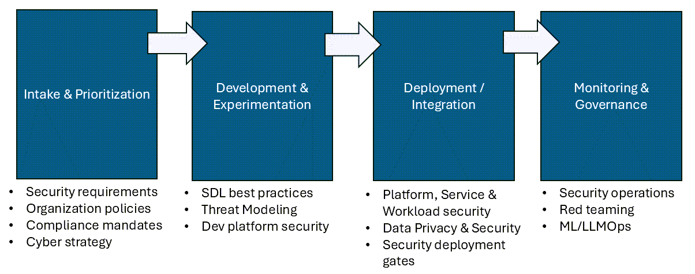
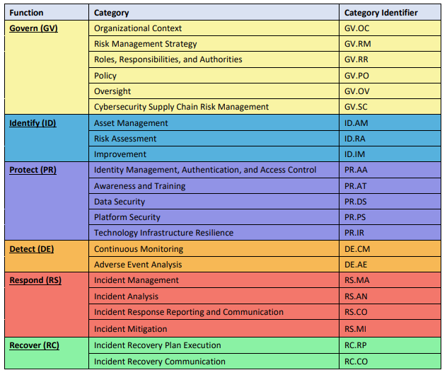
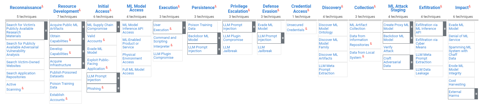
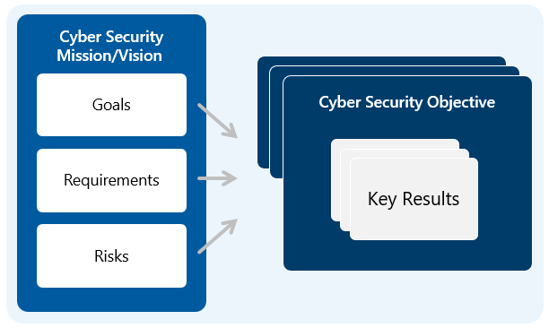
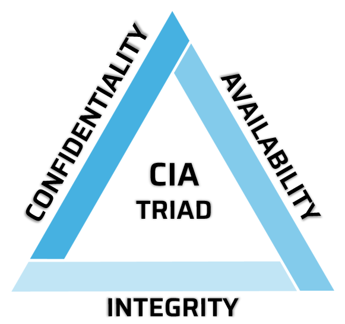

# MAIVA - Security Table of Contents

[Introduction to MAIVA Security](#introduction-to-maiva-security)

- [The Role of Security in the MAIVA Lifecycle](#the-role-of-security-in-the-maiva-lifecycle)

[Security Framework Integration](#security-framework-integration)

- [Security Development Lifecycle](#security-development-lifecycle)
- [NIST CSF](#nist-csf)
- [MITRE ATLAS](#mitre-atlas)

[Intake & Prioritization](#intake--prioritization)

- [Identify Security Requirements](#identify-security-requirements)
- [Establish a Security Governance Framework](#establish-a-security-governance-framework)

[Development & Experimentation](#development--experimentation)

- [Secure Coding Practices and SDL Best Practices](#secure-coding-practices-and-sdl-best-practices)
- [Security During Solution Development](#security-during-solution-development)
- [Threat Modeling](#threat-modeling)

[Deployment / Integration](#deployment--integration)

- [Platform, Service, and Workload Security](#platform-service-and-workload-security)
- [Data Security & Privacy Measures](#data-security--privacy-measures)
- [Security Deployment Gates](#security-deployment-gates)

[Monitoring & Governance](#monitoring--governance)

- [Ongoing Security Operations](#ongoing-security-operations)
- [Proactive Security Operations](#proactive-security-operations)

[Responsible AI and Security](#responsible-ai-and-security)

- [What is Responsible AI?](#what-is-responsible-ai)
- [What is Information Security?](#what-is-information-security)
- [How Do They Relate?](#how-do-they-relate)

[Conclusion](#conclusion)

- [Summary of Key Takeaways](#summary-of-key-takeaways)
- [The Future of Security in the Context of MAIVA and AI Governance](#the-future-of-security-in-the-context-of-maiva-and-ai-governance)

[Gratitude for Contributors](#gratitude-for-contributors)

# Introduction to MAIVA Security

As AI adoption continues to rise, MAIVA provides a pivotal framework for scaling those AI initiatives. In order for AI initiatives to scale, however, security must become a core piece of the framework; this ensures the integrity and trustworthiness of AI systems. This chapter of the MAIVA playbook delves into the critical role of security, underscoring its significance in the broader context of AI industrialization, and providing a framework for ensuring security is appropriately included in an AI industrialization effort.

## The Role of Security in the MAIVA Lifecycle

The lifecycle of an industrialized approach to AI must have security woven throughout. From the initial intake of ideas to the deployment and operationalization of AI models, security considerations are crucial in each stage. The following diagram illustrates these high level security considerations:

# Security Framework Integration

To understand how best to integrate security into these pieces, there are a few well-established security frameworks that can be drawn upon. These include (but aren't limited to) the Microsoft Security Development Lifecycle (SDL), NIST Cybersecurity Framework (CSF), and MITRE ATLAS. These frameworks provide a structured methodology for embedding security into the DNA of AI initiatives.

When considering how best to integrate Security Frameworks, it's important to understand that the frameworks provide a guide, not a rulebook. While each of the frameworks mentioned in this section can be beneficial to an AI initiative, there is some flexibility in the implementation. By leveraging multiple frameworks to support different security goals, each framework brings its own strengths to the table, and can be leveraged to address specific aspects of AI security.

## Security Development Lifecycle

The first security framework to consider is Microsoft's Security Development Lifecycle (SDL). SDL focuses on secure development practices, such as performing security design reviews, threat modeling, security testing, and security training. By leveraging SDL in the AI initiative, you help ensure that security is integrated into each phase of development, from design to deployment.

SDL incorporates 10 key security practices:

1. Establish security standards, metrics, and governance
2. Require use of proven security features, languages, and frameworks
3. Perform security design review and threat modeling
4. Define and use cryptography standards
5. Secure the software supply chain
6. Secure the engineering environment
7. Perform security testing
8. Ensure operational platform security
9. Implement security monitoring and response
10. Provide security training

For more information on SDL, visit the [Microsoft Security Development Lifecycle](https://www.microsoft.com/en-us/securityengineering/sdl/practices) website.

## NIST CSF

The NIST Cybersecurity Framework (CSF) provides guidance on managing cybersecurity rist. The core of CSF (CSF Core) is a taxonomy of high-level security outcomes that an organization can use to reduce cybersecurity risk and assist with compliance requirements. While these security outcomes aren't specifically focused on AI, they serve as general guidance that should be applied to all AI solutions.

At the time of this writing, the current version of the NIST CSF is 2.0. CSF 2.0 includes the following security functions and categories:

Each of the categories in this framework has a set of defined security outcomes. For example, the PR.AA category includes the following security outcomes:

* **PR.AA-01**: Identities and credentials for authorized users, services, and hardware are managed by the organization
* **PR.AA-02**: Identities are proofed and bound to credentials based on the context of interactions
* **PR.AA-03**: Users, services, and hardware are authenticated
* **PR.AA-04**: Identity assertions are protected, conveyed, and verified
* **PR.AA-05**: Access permissions, entitlements, and authorizations are defined in a policy, managed, enforced, and reviewed, and incorporate the principles of least privilege and separation of duties
* **PR.AA-06**: Physical access to assets is managed, monitored, and enforced
commensurate with risk

NIST CSF does not provide specific guidance on how to achieve these outcomes, only that they should be achieved. AI solutions, therefore should have security controls in place to meet these outcomes during the industrialization initiative, along with appropriate accountability and governance measures.

For more information on NIST CSF, visit the [NIST Cybersecurity Framework](https://www.nist.gov/cyberframework) website.

## MITRE ATLAS

The MITRE Corporation is a not-for-profit organization that operates research and development centers sponsored by the U.S. government. MITRE has made several significant contributions to the cybersecurity field. Among those contributions are the MITRE ATT&CK framework, which is a security knowledge base of adversary tactics and techniques based on real-world observations. MITRE ATT&CK is a key resource, which is highly respected and used by many organizations to improve their security posture.

Based on the previous work of the ATT&CK framework, MITRE developed the ATLAS framework. ATLAS (Adversarial Threat Landscape for AI Systems) extends ATT&CK by focusing on the unique challenges and attack vectors associated with AI systems. By leveraging the structured approach of ATT&CK, ATLAS helps organizations anticipate, detect, and respond to attacks targeting AI components.

At the core of ATLAS is a matrix that shows the Tactics (the column headings) and Techniques (the items in each column) adversaries use to exploit AI systems:

Each technique defined in the matrix is linked to a mitigation, which provides guidance on how to defend against the technique. As AI solutions mature through the industrialization process, it will be important for them to adopt the appropriate mitigations found in MITRE ATLAS.

For more information on MITRE ATLAS, visit the [MITRE ATLAS](https://atlas.mitre.org/) website.

# Intake & Prioritization

Security is a foundational component, even in the very beginning of the AI industrialization process. By shifting security left and integrating it early in the lifecycle, security issues are prevented before they arise. This keeps AI projects aligned with organizational security requirements and compliance mandates from the outset, thus preventing any security-driven delays that might slow an AI solution from graduating out of the Proof of Concept stage.

During this phase, it's important to gain an understanding of the organization's security requirements and align the AI initiative with those requirements. This isn't limited to the organization's internal security policies, but also includes industry-specific regulatory requirements, such as HIPAA or GDPR. If industry-specific regulations aren't addressed, it could lead to significant fines or penalties for the organization.

In addition to aligning with security requirements, it's also important to have a cybersecurity strategy in place early on. This strategy should outline the organization's security goals, requirements, and risks, and map them to a set of Security Objectives and Key Results.

By having this strategy in place early on, the security controls implemented in the AI initiative can be linked back to the organization's security goals and requirements. It also provides a linkage from the strategy to the AI initiative, ensuring that the strategy includes AI security as part of the overall security posture. 

## Identify Security Requirements

During Intake and Prioritization, it's important to take some time to identify which security requirements apply to the AI initiative. By identifying and documenting these up front, you will save time during implementation and decrease the likelihood of a security concern becoming a production blocker.

A key piece of the security requirements to consider are your industry-specific regulatory and compliance requirements, such as HIPAA, GDPR, PCI, and others. While these may not all specifically be security requirements, there is typically a strong correlation between regulatory and compliance mandates, and the overall security hygiene of the system. These requirements will by no means make your solution secure - but the solution cannot be secure without them.

The organizational security requirements should also be augmented with a set of security guidelines that are specific to AI solutions. Due to the probabilistic nature of AI, there will likely need to be additional non-heuristic security tests run against the solution. This set of security requirements that are specific to AI solutons should be documented and well understood by anyone leveraging the AI industrialization framework to put an AI solution into production.

## Establish a Security Governance Framework

The last major piece of this phase is to establish a security governance framework that provides the engine by which security policies are defined, and security controls are adopted by AI solutions. The framework should have the following components:

1. A **library of security controls**, which are mapped to the security requirements and security OKRs in the cyberstrategy strategy.
2. A **process defined** for how security controls are approved and deployed into the environment.
3. A **tracking mechanism** that shows the status of each security control in relation to the AI solution.

This framework should not just serve as a one-time implementation checklist, but should rather be an ongoing security governance framework that is continuously updated and used. When a new security threat, vulnerability, or attack vector is made known, appropriate security controls should be added to the framework, and the AI solutions should be updated to implement those controls.

# Development & Experimentation

When the Development & Experimentation phase begins, the focus shifts to building and testing AI solution options. Even though these activities aren't performed in a production environment, it's important to include security considerations in the development and test environments used in this phase - especially if real data is being used in the development and experimentation process.

There are 3 main security considerations in this phase:

1. Developing code that takes into account security best practices
2. Securing the environment that development and experimentation is taking place in
3. Performing early threat modeling exercises on the solution

## Secure Coding Practices and SDL Best Practices

To ensure that any code written during the development phase adheres to good security practices, we recommend following the guidance set out in the Microsoft Security Development Lifecycle (SDL).

For further information on adopting SDL, please visit the [Microsoft SDL Getting Started site](https://www.microsoft.com/en-us/securityengineering/sdl/howto).

## Security During Solution Development

In addition to writing secure code, the platform and services used in the development and test environment also need to be secured. This involves:

* Hardening any servers that the solution is running on
* Applying security best practices to development workstations
* Configuring the appropriate security options on the cloud services used by the solution
* Mitigating security risks that were identified during the threat modeling exercise

A key resource for assisting with these security considerations is the Microsoft Cloud Security Benchmark (MCSB). The MCSB is a set of cloud-agnostic security best practices that can be applied to the development and test environments used in this phase.

For more information on the MCSB, please visit the [Microsoft Cloud Security Benchmark](https://aka.ms/mcsb) website.

## Threat Modeling

Threat Modeling is a process that helps identify potential security threats to a system. There are several threat modeling frameworks available, but the key steps in the process are:

1. Identify the assets that need to be protected
2. Identify the threats to those assets
3. Identify the vulnerabilities that could be exploited by those threats
4. Identify the countermeasures that can be put in place to mitigate the threats

To ensure that the threat modeling exercise is effective, we recommend bringing in a skilled threat modeling expert to guide the process. This expert can help identify threats that might not be immediately obvious, and can help ensure that the countermeasures identified are appropriate for the threats identified.

We often find that a good tool can facilitate threat modeling much more quickly than a manual process. One such tool is the [Microsoft Threat Modeling Tool](https://learn.microsoft.com/en-us/azure/security/develop/threat-modeling-tool). A very good alternative to the Microsoft Threat Modeling Tool is an open source threat modeling toolkit called [Threats Manager Studio](https://threatsmanager.com/).

# Deployment / Integration

During the deployment and integration phase, the solution is moved from the development and test environment to the production environment. In addition to the security measures taken in the previous phases, this phase requires the addition of securing the production environment that the solution lives on, as well as the data that the solution uses.

Alongside of that, it's important to establish security deployment gates that must be met before the solution can be deployed into production. This will ensure that a minimum bar of security is met before the solution is exposed to real-world data and users.

## Platform, Service, and Workload Security

When it comes to securing the production environment that the AI solution is running in, we recommend looking at three distinct areas:

1. **Platform Security**: This includes securing the underlying platform that the AI solution is running on. This could be a cloud platform, an on-premises server, or a hybrid environment. The security measures taken here should follow the guidance laid out in the [Microsoft Cloud Security Benchmark](https://aka.ms/mcsb).
2. **Service Security**: This includes securing the services that the AI solution uses. This could be a cloud service such as Azure OpenAI, a third-party API, or a service running internally on the network. The security measures taken here should include applying appropriate security configuration options to the services, securing the service endpoints, encrypting data in transit, and configuring the appropriate access controls.
3. **AI Workload Security**: This includes securing the AI workload itself. Generally speaking, this includes security of the codebase, DevOps environment, data sources, and APIs/endpoints that reside within the solution. For AI in particular, this also includes implementing AI-specific security mitigations on ML models and language models.

## Data Security & Privacy Measures

To maintain the integrity of the solution in its production state, it's critical to put in place robust data security and privacy measures. These measures include securing the production data, implementing data privacy measures, and enforcing access control.

### Securing Production Data

The data being used by the AI solution needs to be protected while it's being used, as well as when it's not being used. This typically starts with applying the aforementioned platform security controls to the servers and cloud services that the data is hosted in.

In addition to the platform and service security measures, the data should be protected while it's at rest in the data source for an appropriate data encryption mechanism. This could be a database encryption, file encryption, or another method of encryption that is appropriate for the data source.

Data also needs to be appropriately protected by the AI solution while it's being used in the solution's run state. This primarily consists of implementing mechanisms to protect the data while it's in transit, such as the usage of a secure transport protocol. Additionally, and data that's stored locally in the solution should be encrypted, as well. 

### Keeping Data Private

Because of the prevalence of data exposure incidents with AI solutions, many organizations are extra cautious about addressing data privacy. These concerns are valid, and the measures to put in place are highly dependent on how the data is being used by the AI solution.

For example, if the data is being used for training a model, it's important to implement data masking, anonymization, pseudonymization, and tokenization. However, if the data is used in a retrieval augmentation model, you would want to implement access control and auditing measures.

Because there's not a 'one-size-fits-all' approach to data privacy, it's important to understand the data privacy requirements of the AI solution and implement the appropriate measures.

### Enforcing Access Control

In an ideal scenario, the data being used by the AI solution will be accessed on the end user's behalf, and will respect the access control policies that are in place for the data. This means that the AI solution should be able to access the data only when it's necessary, and only when the end user has the appropriate permissions to the data.

There are three factors in realizing this ideal scenario -

1. **Architecture of the AI Solution** - The AI solution needs to be designed to take into account the identity and access control of the end user.
2. **Access Control Infrastructure** - The enterprise must have access control infrastructure in place, which can be leveraged by the AI solution.
3. **Access Policy Enforcement** - The data in question must have access control policies applied to it, which the AI solution can respect.

## Security Deployment Gates

Before the AI solution is deployed into production, it's important to have a set of security deployment gates that must be met. Enforcement of these security gates requires that a security operationalization process is adopted within the operations model of the AI solution.

To achieve this, the security gates should be incorporated into the MLOps or LMOps process that's used for the AI solution, as well as the DevOps environment hosting the integration pipelines.

Additionally, there should be a set of security KPIs that are monitored and reported on, to ensure that the security gates are being met. These KPIs should be tracked in a security dashboard, which is reviewed by the security team on a regular basis.

# Monitoring & Governance

After the solution is deployed into production, the security needs don't end. There should be a focus on ongoing security operations and proactive security measures for as long as the solution exists.

## Ongoing Security Operations

A key factor of the long-term security of the AI solution is appropriately integrating it into the existing Security Operations Center (SOC) processes. By onboarding the solution to the SOC, it gets integrated into the existing monitoring and response processes and tools. This has the benefit of providing continuous monitoring and response to security incidents.

## Proactive Security Operations

Another aspect of ongoing security governance is implementing proactive security practices. Some of these practices are discussed further in this section, but proactive security measures should not be limited to only these topics.

### Security Testing

There are many ways to proactively test the security of a system. For AI solutions in particular, we recommend conducting red teaming activities.

Red teaming will assist with the broader security of the solution by simulating real-world attacks on the system. There are many tools available for assisting a red team in their efforts, but one in particular that we recommend is the free Microsoft PyRIT tool. PyRIT is a Python-based red teaming tool that can execute multi-turn, non-heuristic attacks on AI systems. For more information on PyRIT, visit the [Microsoft PyRIT](https://aka.ms/pyrit) website.

### Security Updates

As time passes, security researchers discover vulnerabilities in software, and often times work with the software vendors to patch those vulnerabilities before they're exploited in the wild. These patches are then released as security updates, which should be applied to systems as soon as possible.

It is therefore important to have a process in place for discovering available security updates, and applying them to the AI solution. This process should be durable, so when a new version of the AI solution is deployed via the deployment automation process, the latest security updates are included.

### Security Training

Security practices aren't only for cybersecurity professionals. Every member of the solution development, deployment, and operations teams should have a baseline knowledge in security best practices. Providing regular security training to developers, data scientists, operators, and others is a very practical way to exercise a proactive security mindset.

Minimally, security training should cover the security requirements of the organization and the standards that each role is expected to uphold. It's highly recommended, however, that the training not stop there. Additionally, the team should be educated on the latest security threats in their area of expertise, and the mitigations to counter the threats.

It's important that the training be conducted regularly, as the security landscape is constantly changing. If the organization updates security policies and requirements in conjunction with the training, the training will be more effective at landing the security guidance with the team.

# Responsible AI and Security

Information Security and Responsible AI are two concepts that are often conflated, but they're actually distinct. In truth, there is a correlation between the two. Responsible AI contains some elements of security, but not all responsible AI principles are specifically focused on security. Likewise, security practices can enhance the trustworthiness of AI systems - and in doing so, you will often find elements of Responsible AI principles expressed as security guidelines.

## What is Responsible AI?

Responsible AI (RAI) is a set of principles that guide the ethical and responsible design, development, and deployment of AI technologies. Responsible AI has 6 principles:

1. **Fairness** - AI systems should treat all people fairly.
2. **Reliability and Safety** - AI systems should perform reliably and safely.
3. **Privacy and Security** - AI systems should be secure and respect privacy.
4. **Inclusiveness** - AI systems should empower everyone and engage people.
5. **Transparency** - AI systems should be understandable.
6. **Accountability** - People should be accountable for AI systems.

For more information on Responsible AI, visit the [Microsoft Responsible AI](https://www.microsoft.com/en-us/ai/responsible-ai) website.

## What is Information Security?

Information Security, on the other hand, focuses on protecting a system from threats. This is often expressed with 3 pillars, known as the CIA Triad:

    

1. **Confidentiality** - Data and their related systems are only accessible to those who are authorized to access it.
2. **Integrity** - Data and their related systems are accurate, reliable, and permit no unauthorized user to access, alter, or otherwise interfere with it.
3. **Availability** - Data and their related systesm are available when needed.

The core responsibility of information security is to protect the systems from threats to these three pillars.

## How Do They Relate?

The clearest intersection between Responsible AI and information security is in the Privacy and Security principle of Responsible AI. This principle explicitly states that in order for an AI system to behave responsibly, it must be secure. From this perspective, security is one of the key concerns of Responsible AI.

This consideration brings information security in as a dependency to Responsible AI. However, security is not dependent on Responsible AI, itself. A system can be secure, and still remain irresponsible. A responsible system, however, must be secure.

Despite this, it's easy to overlook the fact that both Responsible AI and information security are necessary to ensure the trustworthiness of AI systems. Any enterprise driving governance of AI investments requires both. If either Responsible AI or information security are missing, the trustworthiness of the system will quickly erode.

# Conclusion

In conclusion, it is critical to ensure that security is integrated early and throughout the entire AI industrialization initiative. By following the guidance laid out in this chapter, you can be in a better position to keep your AI systems secure and trustworthy throughout their lifecycle.

## Summary of Key Takeaways

The following are a list of the key takeaways from this chapter:

- Security needs to be adopted throughout all phases of the MAIVA lifecycle
- Leverage security frameworks provide a structured methodology for addressing security concerns
- Security requirements need to be identified up front and aligned with the organization's security goals
- Security governance frameworks should be established to ensure that security controls are implemented and maintained
- Secure coding practices and SDL best practices should be followed during the development phase
- Threat modeling should be performed to identify potential security threats to the AI solution
- The platform, services, and AI workload all need to be secured in the production environment
- Data security and privacy measures should be implemented to protect the data used by the AI solution
- Security deployment gates should be established to ensure that a minimum bar of security is met before the solution is deployed into production
- Ongoing security operations and proactive security measures should be implemented to ensure the long-term security of the AI solution
- Responsible AI and information security are both necessary to ensure the trustworthiness of AI systems

## The Future of Security in the Context of MAIVA and AI Governance

As AI governance evolves, security will continue to play a critical role in ensuring the integrity and trustworthiness of AI systems. Adversaries are constantly evolving their tactics, techniques, and procedures. As new threats and attack vectors are discovered, security guidance and mitigations also need to evolve. Therefore, there is no such thing as "done" in the realm of information security. Further advancements and adaptations in security practices will be necessary to address emerging threats and challenges.

As such, the guidance in this chapter has aimed to provide a high-level framework that can be applied to AI solution governance in general, rather than specific security mitigation guidance that becomes quickly outdated. Despite the ever-changing landscape of security, implementing the practices outlined in this chapter will help provide a solid foundation for securing AI systems in the long term.

# Resources

The following resources were used and referenced throughout this chapter:

- [Microsoft Security Development Lifecycle](https://www.microsoft.com/en-us/securityengineering/sdl/practices)
- [NIST Cybersecurity Framework](https://www.nist.gov/cyberframework)
- [MITRE ATLAS](https://atlas.mitre.org/)
- [Microsoft Cloud Security Benchmark](https://aka.ms/mcsb)
- [Microsoft Threat Modeling Tool](https://learn.microsoft.com/en-us/azure/security/develop/threat-modeling-tool)
- [Threats Manager Studio](https://threatsmanager.com/)
- [Microsoft PyRIT](https://aka.ms/pyrit)
- [Microsoft Responsible AI](https://www.microsoft.com/en-us/ai/responsible-ai)

# Gratitude for Contributors

Many thanks and much appreciation to the following for their
contributions and oversight of this effort!

- Ken St. Cyr
- Francois Magnin
- Kimberly O'Donoghue
